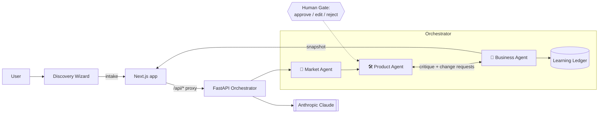

# 👻 GhostCoFounder

**Your AI co-founder for validating and planning startups — build an investor-ready plan in ~10 minutes.**

GhostCoFounder turns a raw idea into a full startup package: market analysis, a product/MVP plan (with architecture + data model diagrams), a business strategy, an investor pitch deck, and a human-in-the-loop **refinement loop** that iterates the plan until it's ready to ship.

It's a monorepo:

| Folder | What it is | Stack |
|--------|-----------|-------|
| [`GhostCoFounder/`](./GhostCoFounder) | Frontend web app | Next.js 14 · React 18 · TypeScript · Tailwind · Framer Motion |
| [`backend/`](./backend) | AI orchestrator API | FastAPI · Anthropic Claude · Pydantic |

---

## ✨ Features

- **Typeform-style discovery wizard** — one question per screen, multi-select, keyboard accessible.
- **Immersive AI processing screen** — a team of agents visibly "collaborating."
- **Three-agent pipeline** — Market → Product → Business, each a specialized Claude agent.
- **Refinement loop** — the Business agent critiques the plan and files change requests; you approve/edit/reject them, and the Product agent rebuilds. Repeats until `ship`.
- **Learning ledger** — dedup memory so the AI never re-litigates a decision.
- **Live pitch-deck preview** + investor artifacts.
- **Light / dark theme**, animated aurora background, neon accents.
- **Mock mode** — run the entire UI with zero backend / zero API cost.

---

## 🏗️ Architecture



**Request flow**

```
Browser ──> Next.js /api/* route (proxy) ──> FastAPI ──> Claude
   ▲                                              │
   └───────────────  Snapshot JSON  ──────────────┘
```

- The frontend never calls Claude directly. Its Next.js API routes (`/api/generate`, `/api/loop/step`, `/api/loop/ship`) proxy to the backend defined by `BACKEND_URL`.
- Every backend response is a single **Snapshot**: `intake`, `market`, `product`, `business`, `ledger`, `iteration`, `status`, `can_continue`. The UI renders straight from it.

### Repo layout

```
ghostFounder/
├── backend/                 FastAPI orchestrator
│   ├── main.py              app + routes
│   ├── orchestrator.py      pipeline, loop, session state, human-gate hook
│   ├── agents/              market.py · product.py · business.py · prompts.py
│   ├── schemas.py           Pydantic contracts (the JSON shapes)
│   ├── ledger.py            dedup "learning ledger"
│   ├── llm.py               Claude client (JSON-only call + repair retry)
│   ├── config.py            env settings
│   └── requirements.txt
└── GhostCoFounder/          Next.js frontend
    ├── app/                 routes, layout, /api/* proxy routes
    ├── components/          wizard · processing · dashboard · artifacts · ui
    ├── services/            orchestratorClient.ts (calls backend or mock)
    ├── lib/                 config.ts (USE_MOCK), answersToIntake.ts
    └── types/               shared TypeScript contracts
```

---

## 🚀 Getting started

### Prerequisites

- **Node.js** ≥ 20
- **Python** ≥ 3.11
- An **Anthropic API key** — get one at <https://console.anthropic.com>

### 1. Clone

```bash
git clone https://github.com/RP2025/ghostFounder.git
cd ghostFounder
```

### 2. Backend (FastAPI)

```bash
cd backend

# create + activate a virtual environment
python -m venv .venv
# macOS / Linux:
source .venv/bin/activate
# Windows (PowerShell):
.venv\Scripts\Activate.ps1

pip install -r requirements.txt

# configure secrets
cp .env.example .env          # Windows: copy .env.example .env
#  ↳ open .env and paste your key:  ANTHROPIC_API_KEY=sk-ant-...

# run it (http://localhost:8000, interactive docs at /docs)
uvicorn main:app --reload
```

> 🔑 **The API key is required** for real generation. Without it, `/generate` returns a `502` Claude error. To try the UI without a key, use **Mock mode** (below).

### 3. Frontend (Next.js)

In a second terminal:

```bash
cd GhostCoFounder
npm install

# point the app at your backend
echo "BACKEND_URL=http://localhost:8000" > .env.local

npm run dev                   # http://localhost:3000
```

Open <http://localhost:3000> and click **Start Building**.

### 4. (Optional) Mock mode — no backend, no API key

Want to demo the full UI instantly, with zero Claude cost?

```bash
# in GhostCoFounder/.env.local
NEXT_PUBLIC_USE_MOCK=true
```

The app then returns a rich, realistic fake snapshot on every step. The client also **falls back to mock automatically** if the backend errors or times out, so the UI never hard-fails.

---

## ⚙️ Environment variables

### `backend/.env`

| Variable | Required | Default | Purpose |
|----------|----------|---------|---------|
| `ANTHROPIC_API_KEY` | ✅ | — | Your Claude API key |
| `CLAUDE_MODEL` | | `claude-sonnet-5` | Model for every agent (`claude-opus-4-8` for max quality) |
| `MAX_TOKENS` | | `8192` | Max tokens per agent response |
| `MAX_LOOP_ITERATIONS` | | `3` | Refinement-loop guardrail |
| `CORS_ORIGINS` | | `http://localhost:3000` | Comma-separated allowed origins (only needed if the browser calls the backend directly) |

### `GhostCoFounder/.env.local`

| Variable | Required | Default | Purpose |
|----------|----------|---------|---------|
| `BACKEND_URL` | ✅ (prod) | `http://localhost:8000` | Backend base URL the Next.js proxy calls (server-side; **not** exposed to the browser) |
| `NEXT_PUBLIC_USE_MOCK` | | `false` | `true` → run entirely on the mock, skipping the backend |

---

## 📡 API reference

Base URL: `http://localhost:8000`

| Method | Path | Body | Purpose |
|--------|------|------|---------|
| `GET`  | `/health` | — | Liveness + active model |
| `POST` | `/generate` | `{ "intake": { …8 fields… } }` | Phase 1: Market → Product → Business review #1 |
| `POST` | `/loop/step` | `{ "session_id", "decisions": [{ "request_id", "decision": "approve\|edit\|reject" }] }` | Advance the refinement loop one iteration |
| `POST` | `/loop/ship` | `{ "session_id" }` | End the loop ("ship it") |
| `GET`  | `/session/{id}` | — | Fetch the current snapshot |

**Intake fields (all strings, all required):**
`idea, motivation, goal, audience, timeline, technical_level, platform, business_model`
— `/generate` returns `422 { missing: [...] }` if any are blank.

---

## ☁️ Deployment

**Recommended:** backend on **Render** (a long-running web service), frontend on **Vercel**.

### Backend → Render

1. New **Web Service** → connect this repo, root directory `backend`.
2. Build: `pip install -r requirements.txt` · Start: `uvicorn main:app --host 0.0.0.0 --port $PORT`
3. Env vars: `ANTHROPIC_API_KEY` (required), optionally `CLAUDE_MODEL`, `MAX_LOOP_ITERATIONS`, `CORS_ORIGINS`.

### Frontend → Vercel

1. Import the repo, set the project root to `GhostCoFounder`.
2. Env var: **`BACKEND_URL`** = your Render URL (e.g. `https://your-backend.onrender.com`).
   Add it for **Production**, then **redeploy** (env changes only apply to new deployments).

> ⚠️ **Known constraints on free tiers**
> - **Render free** spins down when idle → the first request cold-starts (~50s).
> - **Vercel Hobby** caps serverless functions at **60s**; a full generation can take ~2.5 min. If the proxy times out, either upgrade Vercel, or call the backend directly from the browser.
> - Backend sessions are **in-memory** — if the backend restarts between `/generate` and `/loop/step`, the session is lost (`404 Unknown session_id`).

---

## 🧰 Troubleshooting

| Symptom | Likely cause | Fix |
|---------|--------------|-----|
| UI shows generic/"mock" data in prod | `NEXT_PUBLIC_USE_MOCK=true`, or backend unreachable so it fell back | Unset the mock flag; verify `BACKEND_URL` + backend health |
| `/api/generate` → `502`/`500` fast | `BACKEND_URL` unset (defaults to `localhost:8000`) or backend erroring | Set `BACKEND_URL` in Vercel & **redeploy**; check backend logs |
| `/generate` → `502 Claude API error` | Missing/invalid `ANTHROPIC_API_KEY` | Set the key in the backend env |
| Request times out on Vercel | Generation > 60s vs Hobby cap | Vercel Pro, or direct browser→backend calls |
| `404 Unknown session_id` on loop | Backend restarted (in-memory sessions) | Re-run `/generate` to start a fresh session |

---

## 🗺️ Roadmap (Phase 2)

Authentication · artifact history · edit/regenerate individual sections · AI-generated follow-up questions · website builder + landing-page preview · persistent (DB/vector) ledger for cross-run dedup.

---

## 📄 License

MIT — see `LICENSE` (or use freely for your hackathon / project).
